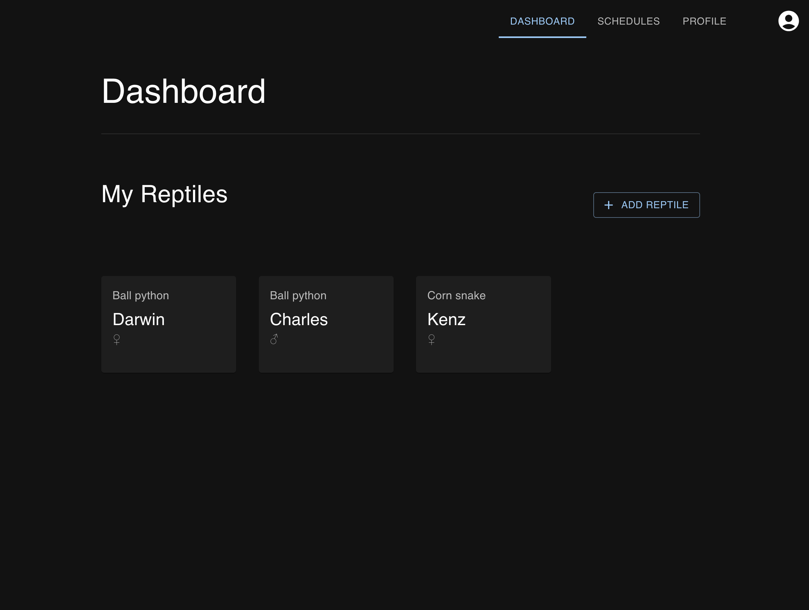
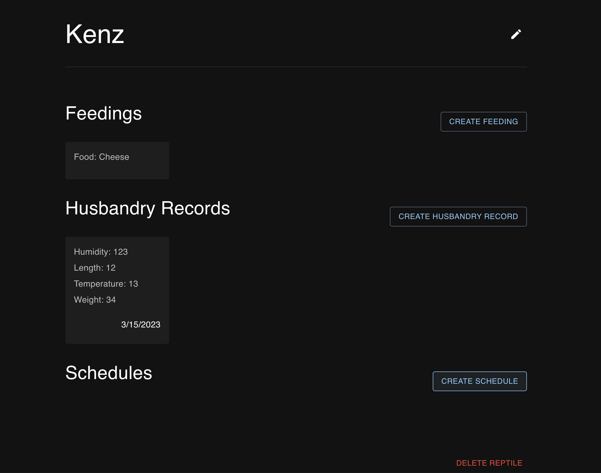
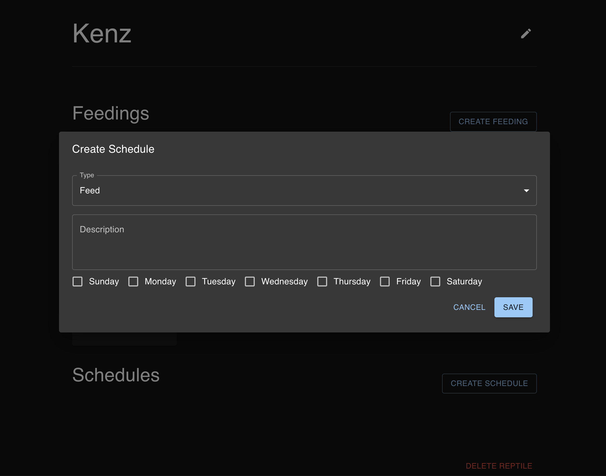

# Reptile Tracker

## Description

The Reptile Tracker is a way to track when you feed your pets and at what times to ensure optimal growth and comfort for your reptiles.

This application use Material UI to create a modern aesthetic for users to interact with.

The Dashboard:


Or the Pet Overview:


Here is an example of the popups:



## Get Started

To Run the Server:

```bash
cd backend
```

### Install the dependencies

```bash
yarn
```

### Migrate Data

```bash
yarn migrate
```

### Start the server by running:

```bash
yarn dev
```

## Production

### Build the project by running

```bash
yarn build
```

## Run the Frontend

```bash
cd frontend
```

#### Install the dependencies

```bash
yarn
```

#### Start the client by running:

```bash
yarn dev
```
